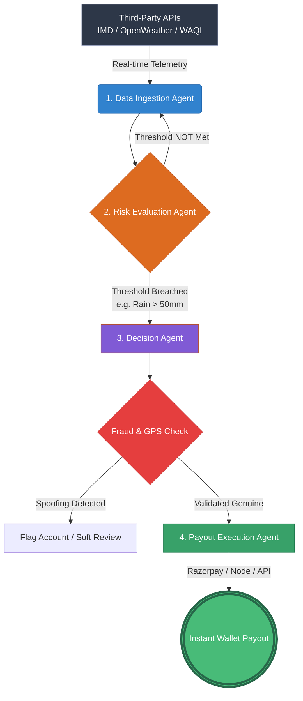

# 🎨 zylocover Frontend - React 18 Insurance UI

> **Modern, responsive React application for gig workers to manage parametric insurance**.

Real-time premium calculations, policy management, claims with fraud transparency, and admin analytics.

---

## 🚀 Quick Start

```bash
# Install dependencies
npm install

# Start dev server (localhost:5173)
npm run dev

# Build for production
npm run build

# Run tests
npm run test

# Run end-to-end tests
npm run test:e2e
```

✅ Visit **http://localhost:5173** to use the app

---

## 📂 Project Structure

```
Frontend/
├── src/
│   ├── pages/                    # 8 main pages
│   │   ├── Index.tsx            # Home
│   │   ├── Onboarding.tsx       # 4-step signup with location
│   │   ├── Plans.tsx            # Coverage tier selection
│   │   ├── Dashboard.tsx        # Policy overview
│   │   ├── Claims.tsx           # Claims history
│   │   ├── Earnings.tsx         # Payouts & analytics
│   │   ├── Monitor.tsx          # Live triggers
│   │   ├── Admin.tsx            # Admin dashboard 📊
│   │   └── NotFound.tsx         # 404
│   │
│   ├── components/              # Reusable UI
│   │   ├── AppShell.tsx        # Layout wrapper
│   │   ├── BottomNav.tsx       # Mobile navigation
│   │   ├── NavLink.tsx         # Nav item
│   │   ├── RiskBadge.tsx       # Zone risk indicator 🌊
│   │   └── ui/                 # 60+ Shadcn/ui components
│   │       ├── button.tsx, card.tsx, input.tsx, etc.
│   │
│   ├── api/                     # API client
│   │   ├── client.ts           # Axios instance
│   │   ├── auth.ts             # Login/signup
│   │   ├── user.ts             # Profile + location
│   │   ├── policy.ts           # Policy CRUD
│   │   ├── pricing.ts          # Premium calculation
│   │   ├── claims.ts           # Claims queries
│   │   └── admin.ts            # Admin endpoints
│   │
│   ├── hooks/
│   │   ├── useApi.ts           # API wrapper
│   │   ├── use-mobile.tsx      # Mobile detection
│   │   └── use-toast.ts        # Toast notifications
│   │
│   ├── App.tsx                 # Main app + routing
│   ├── main.tsx                # Entry point
│   └── index.css               # Tailwind
│
├── package.json
├── vite.config.ts
├── tailwind.config.ts
├── tsconfig.json
└── README.md                   # This file
```

---

## 📄 Key Pages

### 1. Onboarding.tsx - 4-Step Signup
```
Step 1: Email & Password
Step 2: Name, Phone
Step 3: Work Details + 📍 Location Capture
        └─ Browser Geolocation API
        └─ Shows reverse geocoded address
Step 4: Review & Confirm
```

### 2. Plans.tsx - Coverage Tier Selection
```
BASIC      STANDARD     PREMIUM
60% IRR    75% IRR      90% IRR
₹15-25/    ₹25-45/      ₹40-80/
week       week         week

Select → Shows full actuarial breakdown
         ├─ Pure Premium (expected loss)
         ├─ Gross Premium (÷0.67 for margins)
         ├─ Experience Rating
         └─ Final Premium
```

### 3. Dashboard.tsx - Active Policy Overview
```
Your Policy
├─ #: RK-POL-260404-A3F2K1
├─ Coverage: Standard (75%)
├─ Premium: ₹32.50/week
├─ Days Left: 4
├─ Claimed: ₹525 / ₹2,625
└─ Status: ✅ ACTIVE
```

### 4. Claims.tsx - Claims + Fraud Transparency
```
Claim CLM-260404102030-XYZ123
├─ Rain Trigger (68 mm/hr)
├─ Severity: Full (100% loss)
├─ Amount: ₹525.00 ✅ PAID
├─ Fraud Score: 35/100 ✅ APPROVED
│
└─ [View Audit] → Shows all 5 fraud layers
   ├─ Layer 1: Duplicate check → ✅ Pass
   ├─ Layer 2: Policy age → ✅ Pass
   ├─ Layer 3: GPS zone → ✅ Pass
   ├─ Layer 4: Frequency → ✅ Pass
   └─ Layer 5: Anomalies → ⚠️ Score +35 (new account)
```

### 5. Admin.tsx - Real-Time Dashboard
```
├─ Loss Ratio: 72% ✅ (Target)
├─ Combined Ratio: 97% ✅ (Profitable)
├─ Active Policies: 1,250
├─ Claims Today: 127
│   ├─ ✅ Auto-Approved: 118 (93%)
│   ├─ ⚠️ Flagged: 7 (5%)
│   └─ ❌ Rejected: 2 (2%)
├─ Fraud Rate: 2% (Excellent)
├─ Loss Ratio by City Heatmap
└─ Top 10 Risk Users
```

---

## 🔌 API Integration

### Premium Calculator
```typescript
const { data: premium } = await api.pricing.calculate({
  daily_income: 700,
  city: "mumbai",
  zone: "zone_a_flood_prone",
  platform: "swiggy",
  coverage_tier: "standard"
})

// Shows breakdown:
// Pure: ₹8.20
// Gross (÷0.67): ₹12.24
// Experience: 1.0×
// Final: ₹32.50 ✅
```

### User Profile with Location
```typescript
// Get profile (includes GPS coords + address)
const profile = await api.user.getProfile()
// → { name, email, latitude, longitude, address, ... }

// Update profile (with location capture from browser)
await api.user.updateProfile({
  name: "Ravi Kumar",
  avg_daily_income: 700,
  latitude: 19.0760,
  longitude: 72.8777,
  address: "Bangalore, Karnataka"
})
```

### Policy Management
```typescript
// Create 7-day policy
await api.policy.create({ coverage_tier: "standard" })

// Get active policies
const policies = await api.policy.getActive()

// Get specific policy
const policy = await api.policy.getById(5)
```

### Claims History with Fraud Audit
```typescript
// Get all claims
const claims = await api.claims.list()

// Get full fraud audit for a claim
const audit = await api.claims.getAudit(claimId)
// → { fraud_score, layers: [...], decision }
```

---

## 🎨 UI Components

### 60+ Shadcn/ui Components
- ✅ Button, Card, Input, Dialog
- ✅ Table, Tabs, Accordion
- ✅ Sidebar, Navigation Menu
- ✅ Alert, Toast, PopOver
- ✅ Chart, Progress, Slider
- ✅ Calendar, DatePicker
- ✅ Form validation with Zod

### Custom Components
- `RiskBadge` - Zone risk indicator (🌊 Flood Prone Zone - HIGH RISK)
- `AppShell` - Layout wrapper with header/footer
- `BottomNav` - Mobile navigation

---

## 📱 Responsive Design

- ✅ Mobile-first with TailwindCSS
- ✅ Bottom navigation on mobile
- ✅ Touch-friendly buttons (48px min)
- ✅ Gesture support (swipe, pinch)
- ✅ One-handed navigation

---

## 🧪 Testing

```bash
# Unit tests (Vitest)
npm run test

# E2E tests (Playwright)  
npm run test:e2e

# Coverage
npm run test:coverage
```

---

## 🚀 Build & Deploy

```bash
# Build for production
npm run build
# → Outputs to dist/

# Preview production build
npm run preview

# Deploy to Vercel (configured)
vercel deploy
```

### Environment Variables
```env
VITE_API_URL=https://api.zylocover.com
VITE_APP_NAME=zylocover
```

---

## 📦 Key Dependencies

| Package | Purpose |
|---------|---------|
| `react` 18 | UI library |
| `react-router-dom` 6 | Routing |
| `axios` | HTTP client |
| `shadcn/ui` | UI components |
| `tailwindcss` | Styling |
| `typescript` | Type safety |
| `sonner` | Toast notifications |
| `lucide-react` | Icons (200+) |
| `vitest` | Testing |

---

## 🔐 Authentication

JWT-based with AuthContext:

```typescript
const { login, logout, user } = useAuth()

// Login
await login("ravi@example.com", "password")

// Protected routes wrap with ProtectedRoute component

// Auto-logout on 401
if (error.status === 401) {
  logout()
  navigate('/login')
}
```

---

## ✨ Features

- ✅ Real-time premium calculation
- ✅ Actuarial transparency (full breakdown shown)
- ✅ Coverage tier comparison
- ✅ 7-day policy auto-renewal
- ✅ Claims with fraud scores visible
- ✅ Full fraud audit trails (5 layers)
- ✅ Admin real-time analytics
- ✅ Location capture (geolocation API)
- ✅ Mobile-optimized UI
- ✅ Dark mode support (coming soon)

---

## 📞 Support

For issues or questions:
- **Frontend Issues:** frontend@zylocover.in
- **GitHub Issues:** Create issue in repo
- **API Docs:** https://api.zylocover.com/docs

---

**Built with React 18, TypeScript, and Tailwind CSS.** ✨
│   ├── lib/
│   │   └── utils.ts        # Utility functions
│   │
│   ├── types/
│   │   └── api.ts          # TypeScript API interfaces
│   │
│   ├── main.tsx
│   ├── App.tsx
│   └── index.css
│
├── public/
│   ├── robots.txt
│   └── _redirects
│
├── package.json
├── tsconfig.json
├── tailwind.config.ts
├── vite.config.ts
└── vitest.config.ts
```

---

## 🎨 Pages Overview

### 1. **Onboarding** (`/onboarding`)
Signup/login flow with email/password authentication
```
→ Sign up with name, email, password
→ Verify platform & work zone
→ Confirm income details
→ Redirect to dashboard
```

### 2. **Dashboard** (`/`)
Main landing page with real-time stats
```
→ Active policy status
→ Recent claims & payouts
→ Total earnings from insurance
→ Risk profile visualization
```

### 3. **Plans** (`/plans`)
Policy management interface
```
→ View active policy
→ Calculate new premium (actuarial pricing)
→ Purchase 7-day policy
→ View policy history
```

### 4. **Claims** (`/claims`)
Claims history & fraud scores
```
→ List all claims with status
→ View claim details (payout, fraud score)
→ Filter by date range
→ View fraud analysis
```

### 5. **Monitor** (`/monitor`)
Real-time environmental alerts
```
→ Active triggers in user's zone
→ Weather forecast integration
→ AQI alerts
→ Risk visualization
```

### 6. **Admin** (`/admin`)
System-wide dashboard (admin users only)
```
→ Total users, active policies
→ System KPIs & loss ratio
→ Claims statistics
→ Fraud rejection rates
```

---

## 🔌 API Integration

### 1. Authentication Context
```typescript
// src/contexts/AuthContext.tsx
Manages:
- JWT token storage (localStorage)
- User session state
- Login/logout/signup
- Protected route redirection
```

### 2. API Client
```typescript
// src/api/client.ts
Features:
- Automatic JWT injection
- Error handling & retry logic
- Request/response transformers
- Base URL configuration
```

### 3. Data Fetching Hook
```typescript
// src/hooks/useApi.ts
Generic hook for any API endpoint:
- Loading & error states
- Data transformation
- Cache support
```

### 4. Typed API Modules
```typescript
// src/api/user.ts, claims.ts, etc.
Each module wraps backend endpoints:
- Type-safe request/response
- Error handling
- Built on api/client.ts
```

---

## 🔐 Authentication Flow

```
1. User enters email/password on Onboarding page
   ↓
2. POST /auth/signup or /auth/login
   ↓
3. Backend returns JWT token
   ↓
4. Frontend stores in localStorage
   ↓
5. AuthContext updates global state
   ↓
6. API client injects token: Authorization: Bearer <JWT>
   ↓
7. All subsequent requests authenticated
   ↓
8. Dashboard loads protected user data
```

---

## 🎨 UI Component Library (shadcn/ui)

Pre-built components included:
- Forms (input, select, checkbox, textarea)
- Cards & layouts
- Buttons & badges
- Dialogs & modals
- Tables & data grids
- Alerts & notifications
- Tabs & accordions
- Toasts

See `src/components/ui/` for full list.

---

## 🎯 Key Features

✅ **Full TypeScript** - Zero `any` types
✅ **Real API Data** - No mock data anywhere
✅ **JWT Authentication** - Secure token-based auth
✅ **Responsive Design** - Mobile-first approach
✅ **Error Boundaries** - Graceful error handling
✅ **Loading States** - Skeleton screens & spinners
✅ **Form Validation** - Pydantic-level strict
✅ **Toast Notifications** - User feedback

---

## 🔧 Development Commands

```bash
# Start dev server (hot reload)
npm run dev

# Build for production
npm run build

# Preview production build
npm run preview

# Run tests
npm run test

# Run linter
npm run lint
```

---

## 📱 Responsive Design

- **Mobile** (< 640px) - Bottom navigation, full-width layouts
- **Tablet** (640px - 1024px) - Side-by-side layouts
- **Desktop** (> 1024px) - Multi-column dashboards

Hook available: `useIsMobile()` for responsive logic

---

## 🌍 Environment Variables

```env
# Required
VITE_API_URL=http://localhost:8000

# Optional
VITE_APP_NAME=ZyloCover
VITE_APP_ENV=development
```

---

## 🐛 Troubleshooting

**Port 5173 already in use?**
```bash
npm run dev -- --port 5174
```

**Node modules issues?**
```bash
rm -rf node_modules
npm install
```

**TypeScript errors?**
```bash
# Check tsconfig.json is correct
npm run lint
```

**API calls failing with 401?**
```
→ Token might be expired
→ Check localStorage: DevTools → Application → Local Storage
→ Try logging out and back in
```

**CORS errors?**
```
→ Ensure backend is running on :8000
→ Backend has CORS enabled for localhost:5173
→ Check browser console for exact error
```

---

## 🚀 Deployment

### Vercel (Recommended)
```bash
# Already configured in vercel.json
npm run build
vercel deploy
```

### Docker
```bash
docker build -t zylocover-frontend .
docker run -p 3000:3000 zylocover-frontend
```

### Static Host (Netlify, GitHub Pages)
```bash
npm run build
# Deploy dist/ folder
```

---

## 📊 Tech Stack

| Aspect | Technology |
|--------|-----------|
| UI Framework | React 18 |
| Language | TypeScript |
| Build Tool | Vite |
| Styling | Tailwind CSS |
| UI Components | shadcn/ui |
| Forms | React Hook Form |
| HTTP Client | Fetch API |
| State Mgmt | Context API + localStorage |
| Testing | Vitest |
| Playwright E2E | Playwright |

---

## 🔗 Connected Backend Endpoints

All 7 backend modules are integrated:

| Module | Endpoints |
|--------|-----------|
| Auth | `/auth/signup`, `/auth/login` |
| User | `/user/profile`, `/user/stats` |
| Policy | `/policy/create`, `/policy/active` |
| Pricing | `/pricing/calculate` |
| Claims | `/claims/` |
| Trigger | `/trigger/active` |
| Admin | `/admin/dashboard` |

See [../Backend/README.md](../Backend/README.md) for full API docs.

---

## 🎓 Learning Resources

- React: https://react.dev
- TypeScript: https://www.typescriptlang.org
- Tailwind CSS: https://tailwindcss.com
- shadcn/ui: https://ui.shadcn.com
- Vite: https://vitejs.dev

---

**For complete documentation, see [../README.md](../README.md)**

**Backend API Docs:** http://localhost:8000/docs (when backend running)


---

## 1. Problem Overview
India’s platform-based delivery ecosystem involves **15–20+ million gig workers** who operate on day-to-day wages without a financial safety net. Our research indicates these workers can lose up to **20–30% of their income** from uncontrollable micro-disruptions such as monsoon rains, hazardous pollution alerts, and sudden curfews.

**The Failure of Traditional Insurance:**
Traditional policies are ill-suited for this demographic. Gig workers lack the time or literacy to navigate complex claim filing procedures. They live week-to-week; by the time a traditional insurance claim is verified and a check arrives, the worker's family has already suffered from the immediate income wipeout. 

## 2. Persona Definition
**Primary Persona: Urban Food Delivery Partner**
*Example: Ankit, a 23-year-old delivery rider in Bangalore.*

We chose this persona because they have high exposure to external elements and operate in dense urban areas where data collection (weather, AQI) is highly accurate.
* **Workstyle:** Works 6-7 days a week, relies exclusively on an Android smartphone.
* **Platform Hopping:** Rapidly switches between Swiggy, Zomato, and Dunzo to maximize orders.
* **Financial Position:** Earns <₹15,000/month. A single lost day (₹400–500) represents an immediate threat to rent and grocery stability.

---

## 3. Proposed Solution: ParametricGuard
ParametricGuard is an interconnected app and backend platform that offers **weekly parametric micro-insurance** against income loss, coupled with daily utility tools.

Instead of paying out based on subjective claims and manual verification, ParametricGuard relies entirely on **independently verified third-party data**. If a trigger event occurs in the worker's GPS-verified zone, the system automatically compensates their lost income within hours. No forms, no wait times.

### The "Gig-OS" Differentiator (Daily Utility)
Insurance apps are rarely opened unless there is an emergency. To drive daily engagement, ParametricGuard operates as a **Gig-OS**:
* Features a unified earnings dashboard that aggregates weekly payouts across platforms (Swiggy, Zomato).
* Uses historical data to push daily work suggestions (e.g., *"Zone A has high expected demand and only a 30% rain chance—safe to ride!"*).

---

## 4. End-to-End Automated Workflow
ParametricGuard is modeled to be zero-touch post-onboarding. 

1. **User Onboarding:** Rider downloads the app, inputs basic info (city, shift earnings), and verifies via OTP.
2. **AI Risk Profiling & Pricing:** An ML model calculates the upcoming week's premium by analyzing the rider's home zone (e.g., flood history) and the 7-day weather forecast.
3. **Weekly Activation:** Rider pays the micro-premium (via UPI QR/Razorpay) on Sunday night. The policy is instantly active for the week.
4. **Continuous Telemetry Polling:** A background event engine polls APIs (IMD/OpenWeatherMap/WAQI) constantly for real-time conditions in the worker's zone.
5. **Parametric Trigger Detection:** If an agreed-upon threshold is breached, the system raises an alert.
6. **Robust Fraud Validation (Automated):** System verifies the rider's operational GPS trace from the past 2 hours.
7. **Automated Claim & Instant Payout:** A logical claim record is created autonomously. Using Razorpay/UPI APIs, the payout is pushed immediately to the rider's bank account.
8. **Feedback Loop:** Rider receives an SMS: *"Your income is protected: ₹X credited."*

### ⚙️ Automation & AI Pipeline

ZyloCover (ParametricGuard) follows a fully event-driven automated pipeline, powered by specialized agents that constantly operate in the background.



1. **Data Ingestion Agent**  
   *Collects and normalized real-time weather, AQI, and structured external APIs (IMD/OpenWeatherMap/WAQI).*
   
2. **Risk Evaluation Agent**  
   *Evaluates incoming telemetry against the dynamic thresholds and the worker's geographical risk zone.*
   
3. **Decision Agent**  
   *Acts as a truth engine—it cross-references data to determine whether a qualified trigger event has officially occurred while parsing for any anomalies or simulated GPS spoofing.*
   
4. **Payout Execution Agent**  
   *Instantly initiates the automated logical claim and processes the payout directly into the rider's wallet or bank account.*

> *This autonomous pipeline ensures zero manual intervention, guaranteeing a virtually real-time proactive response to disruptions without human adjudication.*

---

## 5. Multi-Layer Fraud Detection & Prevention
**Core Philosophy:** Make fraud economically irrational. We assume bad actors will attempt GPS spoofing. Therefore, our validation utilizes a 4-layer verification stack:

* **Layer 1: GPS & Movement Consistency:** We log the rider's GPS path during shifts. If a payout triggers, the system ensures the rider was truly in the affected zone immediately *before* the event. Claims are flagged if the rider's GPS never left their registered home address or if their location jumps impossibly fast (e.g., 5km in 5 minutes).
* **Layer 2: Device & Network Telemetry:** The app captures device fingerprints (OS version, model) and network cell tower data. Two simultaneous claims from the same Device ID in different cities trigger immediate systemic lockdown of that account.
* **Layer 3: Temporal Machine Learning Models:** Using Unsupervised Anomaly Detection (Isolation Forest), the system learns normal claim timing patterns. If 10 riders submit identical claims at the exact same millisecond from adjacent zones, the model flags it as coordinated fraud.
* **Layer 4: Intelligent Soft Review:** High-confidence legitimate claims bypass all friction. Borderline flagged claims implement a "soft review" where the app asks a simple context question (*"Did it rain in your zone today? Y/N"*). This introduces enough friction to deter automated bot-nets without frustrating legitimate human users.

---

## 6. Financial & Actuarial Model

### The Sachet Pricing Model
Premiums operate on a weekly gig cycle. The baseline premium is **₹20/week**.
* **Dynamic Adjustments:** Safe zones receive a ₹2 discount; severe forecast warnings add ₹10.
* **Subsidies:** Using current Indian labor law mandates (platforms must contribute 1-2% of turnover to welfare), the ₹20 premium is split: 
  * Worker: ₹12
  * Platform (e.g., Swiggy CSR): ₹5
  * Govt e-Shram / NGO Subsidy: ₹3

### Payout Logic & Caps
To guarantee total platform solvency (preventing bank runs), payouts strictly adhere to:
* **Formula:** 50% replacement of the expected daily income for each day lost.
* **Maximum Cap:** Hard capped at ₹500 per week. 
* **Example:** Rider earns ₹400/day. Rain disrupts 2 days. System pays 50% × 2 days × ₹400 = ₹400.

### Fund Architecture
* **60% Claims Reserve:** Held explicitly for payouts (Maintains a secure 60:40 reserve-to-payout ratio).
* **25% Operations:** Servers, APIs, team scaling.
* **15% Investment:** Liquid instruments to grow the mutual pool.

---

## 7. Parametric Triggers Configuration

| Condition | Verified Threshold | Third-Party Source |
| :--- | :--- | :--- |
| **Heavy Rainfall** | Accumulated >50mm in 24 hours | IMD / OpenWeatherMap |
| **Hazardous AQI** | AQI > 400 for a sustained block | WAQI (CPCB Data) |
| **Extreme Heat** | Forecast Temp > 42°C for 2 consecutive days | IMD Forecasts |
| **Curfew / Strike** | Section 144 / Blockades | Google Maps Traffic / NDMA Bulletins |

---

## 8. User Trust & Retention Strategy
We combat historical insurance skepticism through extreme transparency:
* **Zero Paperwork:** Automation is our greatest trust-builder.
* **Radical Transparency:** The UI simply states: *"Rain >50mm → ₹200/day."* No hidden clauses.
* **No-Claim Bonus:** A loyalty program where 4 claim-free weeks earn the rider a ₹20 premium credit for the following week.
* **Social Proof & Identity:** Integration with the government's e-Shram registry via Aadhaar offers the platform institutional credibility. We also implement a P2P referral framework mimicking network-effect gig growth.

---

## 9. Technology Stack

* **Frontend:** React Native (Expo) for Android-first workers; React/Next.js for the administrative web dashboard.
* **Backend Microservices:** Node.js (NestJS / Express) containerized via Docker.
* **Database & Queues:** PostgreSQL (Relational policies/transactions) and Redis (BullMQ for background polling jobs).
* **AI / ML Layer:** Python/FastAPI endpoints utilizing `scikit-learn` and `XGBoost`. Hosted serverlessly via AWS Lambda.
* **Payments:** Razorpay API for premium collection and UPI automated disbursement (NPCI).
* **Notifications:** Twilio (SMS/WhatsApp) and Firebase Cloud Messaging for instant real-time payout alerts.
* **Enterprise Integration Path:** Production pipelines can wrap into **Guidewire PolicyCenter** and **ClaimCenter** APIs.

### AI / ML Specifics
We explicitly avoid vague AI claims. Our models run on 3 specific pipelines:
1. **Pricing (Supervised Learning - XGBoost):** Predicts weekly premium adjustments based on geolocation risk arrays and weather vectors.
2. **Fraud (Unsupervised Learning - Isolation Forest):** Flags spatio-temporal claim anomalies.
3. **Demand Forecasting (Time-Series):** Powering the Gig-OS safe-route advisor.

---

## 10. Scalability & Future State
The microservice, event-driven (BullMQ + Lambda) architecture natively supports horizontal scaling. Deployed via Kubernetes (EKS), ParametricGuard can handle spikes during massive weather events without throttling. 

Eventually, this architecture is designed to operate as a *Headless API*, allowing delivery giants (Zomato/Swiggy) to natively embed ParametricGuard inside their own delivery partner applications.